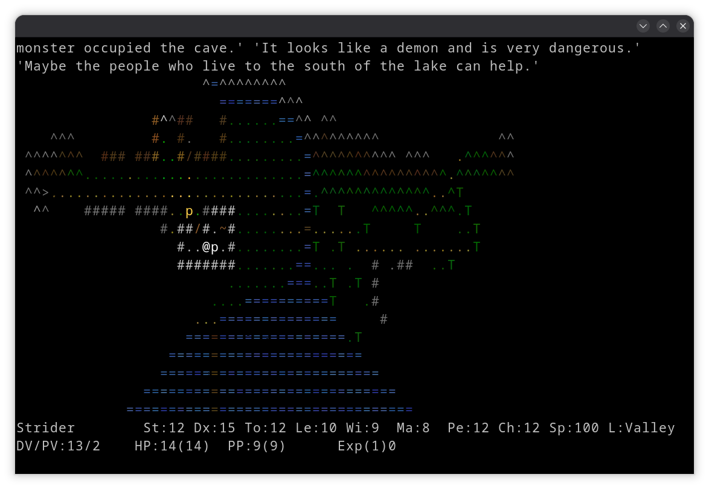
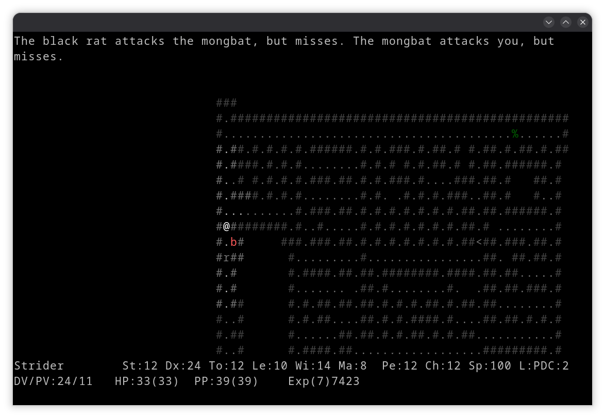

# Avanor: The Land of Mystery

A roguelike from the early 2000s, left alone for twenty years, and now
being finished.

| | |
| :---: | :---: |
|  |  |

You arrive in a valley that has problems, and nobody in it expects much of
you. The village lives on mushrooms out of the caves to the west, and
something has moved into the caves. The armourer in the town wants whatever
is nesting under his shop dealt with, and will let you keep what you carry
back up. The captain of the royal guard can see an orcish war-party
mustering in the southern hills, and he has seven men. Under the mountain
there is a dwarven city whose gold mine has filled with gas. None of it is
your business until you make it your business.

What happens after that is a roguelike. One character, one turn at a time:
the caves and dungeons are laid out afresh every game, food runs out, an
unknown potion is unknown for a reason, and dying ends the run. You can
take a companion along, learn to read, mine, cook, brew, pray and steal.

Two people eventually want something larger than an errand. Gefeon wants
Ahk-Ulan dead, who works his evil in the dungeon beneath his ruined tower
south-east of the town. Ahk-Ulan wants Roderick dead - the King of Avanor,
and the only man left who could stand against him - and is offering the
throne for it. Both are open at once, and nothing in the game stops you
taking both.

**To play it**, take a package from the
[latest release](https://github.com/jaydg/avanor/releases): there is one
for Linux, macOS and Windows, and [Installing a release](#installing-a-release)
says what to do with it. To build it yourself, see
[Building and Running](#building-and-running).

**To change it**, open `world/`. Every creature, item, level, god, quest
and line of dialogue lives there in Lua rather than in the C++, so a new
monster is a text edit and so is a new quest.

---

## Table of Contents

- [Features](#features)
- [Gameplay](#gameplay)
- [Project History](#project-history)
- [Current Status](#current-status)
- [Installing a release](#installing-a-release)
- [Building and Running](#building-and-running)
  - [Required C++ modules](#required-c-modules)
- [Modernization Details](#modernization-details)
- [License](#license)
- [Original Credits](#original-credits)
- [Revival Credits](#revival-credits)
- [Contact](#contact)

---

## Features

### Character System

- **Playable Races**: Human, Half Elf, High Elf, Halfling, Half Orc, Dwarf, Gnome
- **Professions**: Warrior, Wizard, Archer, Ranger, Cleric, Paladin, Alchemist, Bard
- **Core Stats**: Strength, Dexterity, Toughness, Learning, Willpower, Mana, Perception, Charisma
- **Schools of Magic**: Elemental, Body, Protection, Death and Surviving, with more than twenty spells between them
- **Around twenty Skills**: From alchemy to mining, herbalism and climbing
- **Experience & Leveling**: Exponential progression curve

### Game World

- **Multiple Locations**: Main valley, dungeons, caves, towns
- **Dungeon Levels**: Progressive difficulty through depth
- **NPC System**: Unique characters with quests and dialogue, all scripted in Lua

### Combat System

- **Melee Combat**: Attack, defend, special manoeuvres
- **Ranged Combat**: Bows, crossbows, slings, thrown weapons
- **Magic System**: Spells from multiple schools
- **Brand Effects**: Special weapon effects (poison, fire, paralysis, slaying, etc.)
- **Tactics**: A stance from all-out attack to full defence, traded off against your own opening

### Item System

- **Equipment Slots**: Head, neck, body, cloak, two hands, two rings, gloves, boots, missile weapon, missile
- **Item Types**: Weapons, armour, potions, scrolls, books, food, tools, gems, money
- **Crafting**: Alchemy, cooking, mining

### Monster System

- **More than a dozen Creature Classes**: Rats, bats, felines, canines, reptiles, insects, humans, orcs, giants, kobolds, undead, goblins, demons, humanoids, blobs and others
- **Difficulty Tiers**: from the harmless up to the unique
- **AI System**: many base flags and composite presets for diverse behaviours, scriptable in Lua
- **Special Abilities**: Spells, skills, brands, corpse effects

---

## Gameplay

### Quick Start

1. **Create a Character**: Choose race, profession, and gender
2. **Enter the Valley**: Begin your adventure in a village
3. **Explore**: Talk to NPCs, receive hints and accept quests
4. **Descend**: Venture into dungeons and caves
5. **Survive**: Manage food, health, and equipment
6. **Grow**: Gain experience, find better gear, learn new abilities

### Controls

Press `?` in game for the full keyboard layout, which is the authoritative
list. The ones you need first:

| Key             | Action                                    |
| --------------- | ----------------------------------------- |
| `1`-`9`         | Move (numeric keypad layout)              |
| `w` + direction | Walk until something interesting turns up |
| `<` `>`         | Up and down stairs                        |
| `,`             | Pick up what is on the floor              |
| `d`             | Drop                                      |
| `i`             | Inventory                                 |
| `e`             | Equipment - wear, wield, take off         |
| `E`             | Eat                                       |
| `D`             | Drink a potion                            |
| `r`             | Read a scroll or book                     |
| `Z`             | Cast a spell (`^Z` repeats the last one)  |
| `t`             | Shoot at a target                         |
| `a`             | Use a skill (`A` lists them)              |
| `C`             | Chat                                      |
| `o` `c`         | Open and close a door                     |
| `l`             | Look at something                         |
| `@`             | Your character sheet                      |
| `M`             | The messages you have missed              |
| `S`             | Save                                      |
| `Q`             | Quit                                      |

### Tips for New Players

- **Save often**: There is no autosave - `S` is the only thing that writes a save
- **Manage nutrition**: Starvation is a real threat
- **Identify items**: Unknown items can be dangerous or beneficial
- **Learn from failures**: Each death teaches valuable lessons
- **Explore thoroughly**: Hidden secrets abound

---

## Project History

### The Original Era (2000-2006)

Avanor was created in 2000 by Vadim Gaidukevich. Its source code was published
as Open Source under the GPL2 license in 2003. The latest release was 0.5.8 in
2006. Work had begun on creating a new quest and integrating Lua, but that was
never finished.


### The Revival (2025-2026)

In **September 2025**, the project was revived with a major modernization effort.

---

## Current Status

The project is currently in **active modernization** with the following status:

### Completed Modernization Work

**Core Infrastructure**

- Sol2 integration for Lua scripting
- Cereal integration for serialization

**Code Quality**

- Conversion of legacy enums to C++11 enum classes
- Type safety improvements
- Modern C++ features (smart pointers, const correctness, etc.)

**Game Content**

- Every creature defined through the MonsterBuilder interface - more than a
  hundred of them across the Lua files in `world/`, with their dialogue,
  quests and AI beside them
- Levels, tiles, colours and map-generator settings all driven from `world/`

### Ongoing Work

**Documentation**

- Comprehensive documentation of all game systems
- API documentation for developers
- Design documentation for maintainers

**Code Modernization**

- Continued conversion to modern C++ idioms
- Performance optimizations
- Memory management improvements

---

## Installing a release

Every tag builds a package for each platform and puts it on the
[release](https://github.com/jaydg/avanor/releases). Building from source
is the next section; this one is for the packages.

### macOS

There are two disk images and they are not interchangeable, because each
holds one architecture:

| | For |
| --- | --- |
| `avanor-<version>-arm64.dmg` | Apple silicon - M1 and later |
| `avanor-<version>-x86_64.dmg` | Intel |

If you are not sure which you have, the Apple menu, About This Mac, says
so. Taking the wrong one gets you `Bad CPU type in executable`, which is
the only thing it can do - Rosetta translates Intel code for Apple
silicon and not the other way about.

Open the image and drag Avanor into Applications.

The first time you open it, macOS may refuse:

> **"Avanor" Not Opened** - Apple could not verify "Avanor" is free of
> malware that may harm your Mac or compromise your privacy.

That is Gatekeeper saying the application is not signed by a registered
Apple developer, which costs money the project has not spent. Nothing is
wrong with the download. To open it anyway, go to **System Settings**,
**Privacy & Security**, scroll to the bottom, and click **Open Anyway**
beside the message about Avanor. You only have to do this once.

Control-clicking the application and choosing Open used to be a quicker
way through this. macOS 15 removed it; System Settings is now the only
route.

(If you are the person publishing these, [SIGNING.md](SIGNING.md)
describes what it would take to make that dialogue stop appearing.)

### Windows

Run `avanor-<version>.exe`. SmartScreen will probably say "Windows
protected your PC" and give the publisher as unknown, for the same reason
as on macOS. Click **More info**, then **Run anyway**.

### Debian, Ubuntu and Fedora

Install the `.deb` or the `.rpm` from the release:

```bash
sudo apt install ./avanor_*.deb     # Debian, Ubuntu
sudo dnf install ./avanor-*.rpm     # Fedora
```

Both put the game on the path as `avanor`, so there is nothing to drag
anywhere and nothing to approve.

---

## Building and Running

Avanor builds with **GNU Make**.

### Required C++ modules

Everything below is expected to be installed on the system. Nothing is
vendored into the tree and there are no git submodules, so a plain
`git clone` is enough once the packages are in place.

| Module            | Kind           | Used for                                                                                                                                                         | Found via                |
| ----------------- | -------------- | ---------------------------------------------------------------------------------------------------------------------------------------------------------------- | ------------------------ |
| **LuaJIT 2.1**    | shared library | The scripting runtime. Every creature, item, location and quest in `world/` is Lua.                                                                              | `pkg-config luajit`      |
| **sol2 3.x**      | header only    | The C++/Lua binding layer - usertypes, enum tables, protected calls. `#include <sol/sol.hpp>`                                                                    | `/usr/include/sol`       |
| **stc.hpp**       | header only    | The terminal display - plain ANSI escape sequences, with the keyboard read through the Win32 console API or termios. Fetched by the build, nothing to install.   | `external/stc.hpp`       |
| **{fmt} 9+**      | shared library | String formatting throughout the engine and the world scripts' messages.                                                                                         | `pkg-config fmt`         |
| **cereal 1.3**    | header only    | Save and restore. The whole world graph goes through it. `#include <cereal/...>`                                                                                 | `/usr/include/cereal`    |
| **Zstandard**     | shared library | Compresses the save file (`avanor.svg.zst`).                                                                                                                     | `-lzstd`                 |
| **argparse**      | header only    | The command line in `Main.cpp`.                                                                                                                                  | `/usr/include/argparse`  |

A **C++17** compiler is required - the code uses structured bindings,
`std::optional`, `if`-initialisers, `std::string_view` and inline variables.
GCC 9 or Clang 8 upwards will do. It is built and tested with GCC.

On Fedora:

```bash
sudo dnf install gcc-c++ make pkgconf-pkg-config \
                 luajit-devel fmt-devel libzstd-devel \
                 sol2-devel cereal-devel argparse-devel
```

Pushing a tag builds the packages and attaches them to a GitHub release:
a `.deb`, an `.rpm`, a Windows installer, and a macOS disk image for each
of the two architectures.

A Fedora package can be built with `rpmbuild` from `avanor.spec`; it
installs the game as `/usr/bin/avanor` with its world and manual under
`/usr/share/avanor`, which is the path the spec compiles in as `DATA_DIR`.
CI builds one on every tag.

A Debian/Ubuntu package can be built from the tree with
`dpkg-buildpackage -us -uc -b`; it installs the game as `/usr/games/avanor`
and its world and manual under `/usr/share/avanor`, which is the path
`debian/rules` compiles in as `DATA_DIR`. CI builds one on every tag.

To build by hand, on Debian and Ubuntu:

```bash
sudo apt install g++ make pkg-config \
                 libluajit-5.1-dev libfmt-dev libzstd-dev \
                 sol2-dev libcereal-dev libargparse-dev
```

Note the names differ from Fedora's, and so does what is available when:
`sol2-dev` arrived in 26.04, `libargparse-dev` in 24.04. On an older release
drop those headers under `/usr/local/include` instead - the build finds them
on the default include path.

### Building

```bash
make -j$(nproc)          # release build -> ./avanor
make debug=1 -j$(nproc)  # debug build with symbols -> ./avanor-d
```

The two builds keep their objects apart (`obj/` and `obj-d/`), so they do
not tread on each other. `make clean` clears both of them and both
binaries, whichever flags you pass it; the headers the build fetches into
`external/` are left alone.

#### The notcurses backend

The terminal is driven by plain ANSI escape sequences, which is why the
list above has no display library in it: there is nothing to find, package
or ship. `notcurses=1` builds against
[notcurses](https://github.com/dankamongmen/notcurses) instead. What that
buys is its own terminal capability negotiation. Both backends follow the
window when it changes shape: SIGWINCH says so on Linux and macOS, and on
Windows the plain backend reads the console's own event queue, there being
no escape sequence anywhere for a resize:

```bash
sudo dnf install notcurses-devel   # or libnotcurses++-dev on Debian/Ubuntu
make notcurses=1 -j$(nproc)
```

Both backends produce the same `avanor` out of the same `obj/`, and nothing
in a source file says which one built it, so switching between them needs a
`make clean` first - without one make finds nothing to do and leaves the
binary already standing. The two sit side by side in `engine/global.cpp`
under `USE_NOTCURSES`.

### Running

```bash
./avanor                 # play
./avanor --god           # play with a thousand extra hit points and optional death
./avanor --seed 7        # build the world from a fixed seed
./avanor --demo          # watch the world run itself, no hero
./avanor --help
```

The game keeps its files in `~/.avanor`: the save (`avanor.svg.zst`), the
high score table, and the optional memorial file for dead characters.

---

## Modernization Details

### Technologies Adopted

| Legacy               | Modern                        | Benefit                                             |
| -------------------- | ----------------------------- | --------------------------------------------------- |
| Custom Lua binding   | **Sol2**                      | Type-safe, modern C++ API                           |
| Bundled Lua 5.0      | **LuaJIT**                    | JIT compilation, performance, Lua 5.1 compatibility |
| Custom save/load     | **Cereal**                    | Header-only, powerful serialization                 |
| Enum raw values      | **enum class**                | Type safety, scoped enumerators                     |
| Raw pointers         | **Smart pointers**            | Automatic memory management                         |
| C and Custom strings | **std::string**               | Standard library string functionality               |
| Custom containers    | **std::vector**, **std::map** | Standard library containers                         |

### Key Changes from Original

1. **Lua Runtime**: Migration from bundled Lua 5.0 to LuaJIT
2. **Lua Binding**: Complete rewrite using Sol2
3. **Serialization**: Migration from XFile to Cereal
4. **Monster Definitions**: New MonsterBuilder fluent interface
5. **Type Safety**: Widespread use of enum classes
6. **Code Organization**: Improved namespace usage and encapsulation

---

## License

Avanor is released under the **GNU General Public License version 2 or later (GPLv2+)**.

---

## Original Credits

**Original Author:**

- Vadim Gaidukevich - Project founder and primary developer

---

## Revival Credits

**Project Revival (2025-2026):**

- Joachim de Groot - Modernization, Sol2/Cereal integration, LuaJIT adoption

---

## Contact

For questions, feedback, or contributions:

- **Project Repository**: [GitHub](https://github.com/jaydg/avanor)
